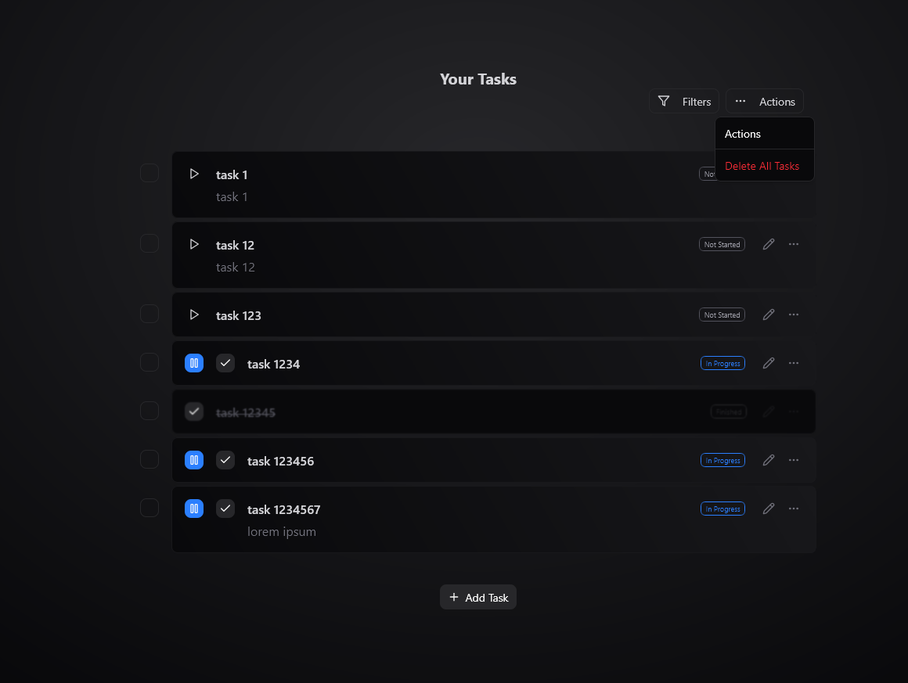

# Task Manager Application

A full-stack Task Manager application built with NestJS (GraphQL API) backend and React frontend.

## Project Overview

This Task Manager application allows users to create, read, update, and delete tasks through a clean user interface. The application consists of:

- **Backend**: NestJS server with GraphQL API
- **Frontend**: React application with shadcn ui library + motion + tailwindCSS for styling
- **Database**: MongoDB for data persistence

## Screenshots

### 1. Overall View of Tasks


### 2. Adding/Editing Tasks


### 3. Filters Popover


### 4. Task Actions



### 5. Selecting Tasks


## Tech Stack

### Backend

- NestJS
- GraphQL (Apollo Server)
- TypeScript
- MongoDB with Mongoose
- Class-validator for input validation
- Jest for testing

### Frontend

- React
- TypeScript
- Apollo Client for GraphQL communication
- React Hook Form for form handling
- tailwindCSS for styling
- Jest and React Testing Library

## Features

- Create, read, update, and delete tasks
- Task filtering and sorting
- Form validation
- Responsive design
- Error handling
- Loading states

## Getting Started

### Prerequisites

- Node.js (v16.x or later)
- npm or yarn
- MongoDB (local installation or MongoDB Atlas account)

### Installation

1. Clone the repository

```bash
git clone https://github.com/kudziajaroslaw98/typeofcode-todo.git

or through ssh

git clone git@github.com:kudziajaroslaw98/typeofcode-todo.git

cd task-manager
```

2. Install dependencies for both backend and frontend

```bash
# Install backend dependencies
cd apps/api
npm install

# Install frontend dependencies
cd apps/web
npm install
```

3. If needed set the correct mongo db url in this file:

```bash
cd apps\api\src\app\db\database.providers.ts
```

```typescript
export const databaseProviders = [
  {
    provide: "DATABASE_CONNECTION",
    useFactory: (): Promise<typeof mongoose> => mongoose.connect("mongodb://<URL>/<DB_NAME>"),
  },
];
```

If you change to custom url please make sure to modify the test config:

```bash
cd apps\api\test\test-config.ts
```

```typescript
export const config = {
  Memory: true,
  IP: "127.0.0.1", // Url
  Port: "27017",
  Database: "nest", // Db name
  DBPath: "/data/db",
};
```

### Running the Application

#### Development Mode

Turborepo is prepared to launch both api and web applications from a single line:

```bash
# From the root directory (before apps)
npx turbo dev
```

You can also start the servers independently:

1. Start the backend server:

```bash
# From the backend directory
cd apps/api
npm run dev
```

2. Start the frontend development server:

```bash
# From the frontend directory
cd apps/web
npm run dev
```

3. Open your browser and navigate to `http://localhost:3000`

#### Production Build

Turborepo is prepared to build both api and web applications from a single line:

```bash
# From the root directory (before apps)
npx turbo build
```

You can also build the servers independently:

1. Build the backend:

```bash
# From the backend directory
cd apps/api
npm run build
```

2. Build the frontend:

```bash
# From the frontend directory
cd apps/web
npm run build
```

## Project Structure

```
task-manager
├── apps/
│   ├── api/              # NestJS GraphQL API
│   │   ├── src/
│   │   │   ├── app/          # app directory containing db and tasks modules / services etc.
│   │   │   ├── main.ts       # Application entry point
│   │   │   ├── app.module.ts # Root module
│   │   │   ├── schema.gql    # Generated GraphQL schema
│   │   │   └── config/       # Configuration files
│   │   ├── test/             # Test files
│   │   └── package.json
│   ├── web/             # React application
│   │   ├── src/
│   │   │   ├── components/   # Reusable UI components
│   │   │   ├── routes/       # Page components
│   │   │   ├── queries/      # GraphQL queries and mutations
│   │   │   ├── hooks/        # Custom React hooks
│   │   │   ├── assets/       # Assets
│   │   │   ├── helpers/      # Helper functions
│   │   │   ├── lib/          # Utility functions
│   │   │   └── App.tsx       # Root component
│   │   ├── public/           # Static assets
│   │   └── package.json
└── README.md             # This file
```

## API Documentation

### GraphQL Schema

The GraphQL API provides the following operations:

#### Queries

- `tasks`: Fetch all tasks
- `task(id: ID!)`: Fetch a single task by ID

#### Mutations

- `createTask(input: TaskInput!): TaskDto!`: Create a new task
- `updateTask(id: String!, input: TaskUpdateInput!): TaskDto!`: Update an existing task
- `removeTask(id: String!): DeleteResponseDto!`: Delete a task
- `removeTasks(ids: [String!]!): DeleteResponseDto!`: Delete a bunch of tasks
- `removeAllTasks: DeleteResponseDto!`: Delete all tasks

### Data Models

#### Task

- `id`: Unique identifier
- `title`: Task title
- `description`: Task description
- `state`: Task status (e.g., 'TODO', 'DOING', 'DONE')
- `startedAt`: (Optional) Start date (when state is changed to "DOING")
- `timeSpent`: Calculated time spent on the tasks (calculated after switching to "DONE" or "TODO" from "DOING")
- `createdAt`: Creation timestamp
- `updatedAt`: Last update timestamp

## Implementation Decisions

1. **Database Schema Design**: I chose to implement a Task model with sufficient fields to demonstrate a real-world task management system while keeping it simple enough for the scope of this assignment.

2. **Error Handling**: The application implements comprehensive error handling on both the backend and frontend to provide clear feedback to users when operations fail.

3. **State Management**: I used Apollo Client's cache for state management on the frontend, which provides efficient data handling for GraphQL operations without the need for additional state management libraries.

## Future Improvements

With additional time, I would implement:

1. User authentication and authorization
2. Task categories and tags
3. Advanced filtering and search capabilities
4. Task assignment to users
5. Notifications for due dates
6. More comprehensive test coverage
7. Performance optimizations for larger datasets
8. Workspaces

## Testing

### Backend

For backend testing i have decided to go for in-memory-mongo.
Everything will be setup when you launch the test script.

```bash
# From the backend directory
cd apps/api
npm run test
```

### Frontend

```bash
# From the frontend directory
cd apps/web
npm test
```

## Deployment

The application can be deployed on various platforms:

- **Backend**: Heroku, AWS, Digital Ocean, etc.
- **Frontend**: Netlify, Vercel, AWS S3, etc.
- **Database**: MongoDB Atlas

Detailed deployment instructions would depend on the chosen platform.

## Contributing

Please read [CONTRIBUTING.md](CONTRIBUTING.md) for details on our code of conduct and the process for submitting pull requests.

## License

This project is licensed under the MIT License - see the [LICENSE](LICENSE) file for details.
